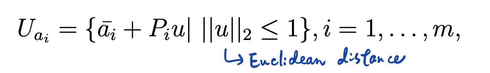

# Two Approaches for Preventive Maintenance Scheduling Problem

[TOC]

## Introduction

The preventive maintenance sheduling problem is frequently faced by factories that have uncertainties on deterioration, demand and yeilding situation. We have to trade off between conducting PM / CM and simply set up the machine and produced. Of course, the amount of production and storage are important issues, as well.

Details of this problem described by the following stochastic model can be find in https://github.com/jerryshen1216/ORA_Project_RL_PM/blob/main/README.md. The link also provides another solution -- Reinforcement learning on this topic.

### Stochastic Model

####  Sets

$T$: Periods taken in to consideration, $T = \{0, 1, ..., |T| - 1\}$. 

> There are no decisions in period $0$, which is the initial state.

$S$: Possible stages of the machine, $S = \{0, 1, ..., |S|-1\}$. 

> The machine get worse while the number of stage increases.

$U_a$: Yeilding coefficient set. 

#### Parameters

$C^S$: Stockout cost per unit of product.

$C^H$: Holding cost per unit of product.

$C^{CM}$: Cost of adopting corrective maintenance for one time.

$C^{PM}$: Cost of adopting preventive maintenance for one time.

$T^{PM}$: Number of periods spent by adopting preventive maintenance once.

$T^{CM}$: Number of periods spent by adopting corrective maintenance once.

$H^{\text{max}}$: Maximum holding amount.

$H^I$: Initial state of holding amount.

$B^I$: Initial state of back order amount.

$S^I$: Initial state of machine stage.

$R$: Number of recovery stage count for a preventive maintenance. 

$M$: Big number

#### Functions

$Y(s)$: Maximum yeilding amount per period of a machine in stage $s$.

> For example, $Y(s) = 100 \cdot (5 - s)$.

$W(s)$: A binary function represents whether deteriorate at stage $s$ or not.

$D(t)$: Demand of product in period $t$.

#### Decision Variables

$x_t$: Number of production amount in period $t$,  $t \in T$

$z^{PM}_t$: Whether PM is adopted or not in period $t$, $t \in T$

$z^{CM}_t$: Whether CM is adopted or not in period $t$, $t \in T$

$s_t$: Stage of the machine in period $t$, $t \in T$

$z^P_t$: Whether the machine set up or not in period $t$, $t \in T$

$b_t$: Number of back order amount in period $t$, $t \in T$

$h_t$: Number of holding amount in period $t$,  $t \in T$

#### Objectives

$\text{min}$ Holding_cost + Back_order_cost + PM_cost + CM_cost

Holding_cost $\displaystyle{=C^H \cdot \sum_{t \in T} h_t}$

Back_order_cost $\displaystyle{=C^S \cdot \sum_{t \in T}b_t}$

PM_cost $\displaystyle{=C^{PM} \cdot \sum_{t \in T}z^{PM}_t}$

CM_cost $\displaystyle{=C^{CM} \cdot \sum_{t \in T}z^{CM}_t}$

#### Constraints

Initialization of the states.

$x_0 = z^{PM}_0 = z^{CM}_0 = z^P_0 = 0$

$h_0 = H^I$

$b_0 = B^I$

$s_0 = S^I$

---

Once if starting PM or CM, the following days cannot start PM or CM anymore.

$\displaystyle{(1-z^{PM}_t) \cdot M \geq \sum_{t^\prime=t+1,\\t^\prime \in T}^{t+T^{PM}-1}z^{PM}_{t^\prime} + z^{CM}_{t^\prime}, \forall t \in T}$

$\displaystyle{(1-z^{CM}_t) \cdot M \geq \sum_{t^\prime=t+1,\\t^\prime \in T}^{t+T^{CM}-1}z^{PM}_{t^\prime} + z^{CM}_{t^\prime}, \forall t \in T}$

---

Once if starting PM or CM, the following days cannot produce any thing.

$\displaystyle{(1-z^{PM}_t) \cdot M \geq \sum_{t^\prime=t,\\t^\prime \in T}^{t+T^{PM}-1}x_{t^\prime}, \forall t \in T}$

$\displaystyle{(1-z^{CM}_t) \cdot M \geq \sum_{t^\prime=t,\\t^\prime \in T}^{t+T^{CM}-1}x_{t^\prime}, \forall t \in T}$

---

In every period, the machine can only be in resting, starting PM, starting CM, producing, maintenancing.

$z^{PM}_t + z^{CM}_t + z^P_t \leq 1, \forall t \in T$

---

If and only if the machine break down can we conduct CM.

$(|S| - 1) - s_t \leq (1 - z_t^{CM}) \cdot M, \forall t \in T$

$1-((|S|-1) - s_t) \cdot M \leq z^{CM}_t, \forall t \in T$

---

The machine stage should recover after starting PM or CM.

$(1-z^{CM}_t) \cdot M \geq s_{t+1}, \forall t \in T, t \neq |T| - 1$

$s_{t+1} \geq (s_t - R) - (1 - z^{PM}_t) \cdot M, \forall t \in T, t \neq |T| - 1$

---

If set up, the stage of machine may deteriorate at a probable level.

$s_{t+1} \geq s_{t} + W(s_t) - (1 - z^P_t) \cdot M, \forall t \in T, t \neq |T| - 1$

$s_{t+1} \leq s_{t} + W(s_t) + (1 - z^P_t) \cdot M, \forall t \in T, t \neq |T| - 1$ 

---

Determine set up or not. 

$z^P_t \cdot M \geq x_t, \forall t \in T$

$x_t \geq z^P_t, \forall t \in T$

---

If not producing or adopting PM / CM, the machine stage should stay unchanged.

$s_{t+1} \geq s_{t} - (z^P_t + z^{PM}_t + z^{CM}_t) \cdot M, \forall t \in T, t \neq |T|-1$

$s_{t+1} \leq s_{t} + (z^P_t + z^{PM}_t + z^{CM}_t) \cdot M, \forall t \in T, t \neq |T|-1$

---

Determine the largest yield amount.

$x_t \leq Y(s_t), \forall t \in T$

---

Maintainence of holding, stock out, and supply / demand balance.

$\displaystyle{h_{t} = a x_t + h_{t-1} + b_t - D(t) - b_{t-1}, \forall t \in T, t \neq 0, a \in U_a}$

---

Maximum inventory level.

$h_t \leq H^{\text{max}}, \forall t \in T$

---

Domain of the variables.

$x_t \in \mathbb{N}, \forall t \in T$

$z^{PM}_t \in \{0,1\}, \forall t \in T$

$z^{CM}_t \in \{0,1\}, \forall t \in T$

$s_t \in S, t \in T$

$z^P_t \in \{0, 1\}, t \in T$

$b_t \in \mathbb{N}, t \in T$

$h_t \in \mathbb{N}, t \in T$

### Uncertainties

The uncertainties in the model are shown in the following two constraints:

1. If set up, the stage of machine may deteriorate at a probable level.

    - $s_{t+1} \geq s_{t} + W(s_t) - (1 - z^P_t) \cdot M, \forall t \in T, t \neq |T| - 1$

        $s_{t+1} \leq s_{t} + W(s_t) + (1 - z^P_t) \cdot M, \forall t \in T, t \neq |T| - 1$ 

    - The function $W(s_t)$ takes probabilities into consideration, and give a binary output of "wearing out or not" under some uncertainties.

    - In this project, the uncertainty is assumed to follow exponential distribution.

2. Maintainence of holding, stock out, and supply / demand balance.

    - $\displaystyle{h_{t} = a x_t + h_{t-1} + b_t - D(t) - b_{t-1}, \forall t \in T, t \neq 0, a \in U_a}$
    - There are two uncertainty factors in the constraints, including $a$, which comes from a uncertainty set represents prosability of defect rate, and $D(t)$ is a function give a output of demand that may have fluctuations.
    - In this project, $D(t)$ follows triangular distribution and $a$ follows binomial distribution.


## Probabilistic Model

To solve the stochastic model shown above, we can transform it into probabilistic one and use solver to get solutions of some instances.

Probabilistic model handle the uncertainties by sampling. We sampled from distributions using numpy functions, and simply substitute the uncertainty parts of the model. This process are replicated for 50 times and we analysis its solutions to get conclusions.

### Sets

$T$: Periods taken in to consideration, $T = \{0, 1, ..., |T| - 1\}$. 

$S$: Possible stages of the machine, $S = \{0, 1, ..., |S|-1\}$. 

### Parameters

$C^S$: Stockout cost per unit of product.

$C^H$: Holding cost per unit of product.

$C^{CM}$: Cost of adopting corrective maintenance for one time.

$C^{PM}$: Cost of adopting preventive maintenance for one time.

$T^{PM}$: Number of periods spent by adopting preventive maintenance once.

$T^{CM}$: Number of periods spent by adopting corrective maintenance once.

$H^{\text{max}}$: Maximum holding amount.

$H^I$: Initial state of holding amount.

$B^I$: Initial state of back order amount.

$S^I$: Initial state of machine stage.

$R$: Number of recovery stage count for a preventive maintenance. 

$M$: Big number.

$m$：Very small positive number ($0.0001$)

$W^P_\hat{s}$: The threshold value of machine wearing out at stage $\hat{s}$. If $W_t$ get less than it, then machine will deteriorate next period. $\hat{s} \in S$

$W_t$: A random generated number from uniform distribution used to identify whether the machine wear out or not. $t \in T$

$D_t$: Demand in period $t$. $t \in T$

$A$: Good production rate. ($ = 1-\text{defect_rate}$)

### Fucntions

$Y(s)$: Maximum yeilding amount per period of a machine in stage $s$.

> For example, $Y(s) = 100 \cdot (5 - s)$.

### Decision variables

$x_t$: Number of production amount in period $t$,  $t \in T$

$z^{PM}_t$: Whether PM is adopted or not in period $t$, $t \in T$

$z^{CM}_t$: Whether CM is adopted or not in period $t$, $t \in T$

$s_t$: Stage of the machine in period $t$, $t \in T$

$z^P_t$: Whether the machine set up or not in period $t$, $t \in T$

$b_t$: Number of back order amount in period $t$, $t \in T$

$h_t$: Number of holding amount in period $t$,  $t \in T$

$z^{S}_{\hat{s}t}$: Whether the machine in stage $\hat{s}$ in period $t$ or not. $\hat{s} \in S, t \in T$

$z^W_t$: Whether the machine deteriorated in period $t$, $t \in T$

### Objectives

$\text{min}$ Holding_cost + Back_order_cost + PM_cost + CM_cost

Holding_cost $\displaystyle{=C^H \cdot \sum_{t \in T} h_t}$

Back_order_cost $\displaystyle{=C^S \cdot \sum_{t \in T}b_t}$

PM_cost $\displaystyle{=C^{PM} \cdot \sum_{t \in T}z^{PM}_t}$

CM_cost $\displaystyle{=C^{CM} \cdot \sum_{t \in T}z^{CM}_t}$

### Constraints

Initialization of the states.

$x_0 = z^{PM}_0 = z^{CM}_0 = z^P_0 = 0$

$h_0 = H^I$

$b_0 = B^I$

$s_0 = S^I$

---

Once if starting PM or CM, the following days cannot start PM or CM anymore.

$\displaystyle{(1-z^{PM}_t) \cdot M \geq \sum_{t^\prime=t+1,\\t^\prime \in T}^{t+T^{PM}-1}z^{PM}_{t^\prime} + z^{CM}_{t^\prime}, \forall t \in T}$

$\displaystyle{(1-z^{CM}_t) \cdot M \geq \sum_{t^\prime=t+1,\\t^\prime \in T}^{t+T^{CM}-1}z^{PM}_{t^\prime} + z^{CM}_{t^\prime}, \forall t \in T}$

---

Once if starting PM or CM, the following days cannot produce any thing.

$\displaystyle{(1-z^{PM}_t) \cdot M \geq \sum_{t^\prime=t,\\t^\prime \in T}^{t+T^{PM}-1}x_{t^\prime}, \forall t \in T}$

$\displaystyle{(1-z^{CM}_t) \cdot M \geq \sum_{t^\prime=t,\\t^\prime \in T}^{t+T^{CM}-1}x_{t^\prime}, \forall t \in T}$

---

In every period, the machine can only be in resting, starting PM, starting CM, producing, maintenancing.

$z^{PM}_t + z^{CM}_t + z^P_t \leq 1, \forall t \in T$

---

If and only if the machine break down can we conduct CM.

$(|S| - 1) - s_t \leq (1 - z_t^{CM}) \cdot M, \forall t \in T$

$1-((|S|-1) - s_t) \cdot M \leq z^{CM}_t, \forall t \in T$

---

The machine stage should recover after starting PM or CM.

$(1-z^{CM}_t) \cdot M \geq s_{t+1}, \forall t \in T, t \neq |T| - 1$

$s_{t+1} \geq (s_t - R) - (1 - z^{PM}_t) \cdot M, \forall t \in T, t \neq |T| - 1$

---

If set up, the stage of machine may deteriorate at a probable level.

$s_{t+1} \geq s_{t} + z^W_t - (1 - z^P_t) \cdot M, \forall t \in T, t \neq |T| - 1$

$s_{t+1} \leq s_{t} + z^W_t + (1 - z^P_t) \cdot M, \forall t \in T, t \neq |T| - 1$ 

---

Determine set up or not. 

$z^P_t \cdot M \geq x_t, \forall t \in T$

$x_t \geq z^P_t, \forall t \in T$

---

Determine the stage of machine in each period. 

$\hat{s} - s_t \leq M \cdot (1 - z^S_{\hat{s}t}), \forall \hat{s} \in S, t \in T$

$s_t - \hat{s} \leq M \cdot (1 - z^S_{\hat{s}t}), \forall \hat{s} \in S, t \in T$

$\displaystyle{\sum_{\hat{s} \in S}z^S_{\hat{s}t} = 1, \forall t \in T}$ 

---

Determine whether the machine deteriorated or not. 

$\displaystyle{z^W_t \geq (\sum_{\hat{s} \in S} z^S_{\hat{s}t}W^P_{\hat{s}}) - W_t}, \forall t \in T$

$\displaystyle{-M \cdot (1 - z^W_t) \leq (\sum_{\hat{s} \in S} z^S_{\hat{s}t}W^P_{\hat{s}}) - W_t}, \forall t \in T$

---

If not producing or adopting PM / CM, the machine stage should stay unchanged.

$s_{t+1} \geq s_{t} - (z^P_t + z^{PM}_t + z^{CM}_t) \cdot M, \forall t \in T, t \neq |T|-1$

$s_{t+1} \leq s_{t} + (z^P_t + z^{PM}_t + z^{CM}_t) \cdot M, \forall t \in T, t \neq |T|-1$

---

Determine the largest yield amount.

$x_t \leq Y(s_t), \forall t \in T$

---

Maintainence of holding, stock out, and supply / demand balance.

$\displaystyle{h_{t} = A \cdot x_t + h_{t-1} + b_t - D_t - b_{t-1}, \forall t \in T, t \neq 0}$

---

Maximum inventory level.

$h_t \leq H^{\text{max}}, \forall t \in T$

---

Domain of the variables.

$x_t \in \mathbb{N}, \forall t \in T$

$z^{PM}_t \in \{0,1\}, \forall t \in T$

$z^{CM}_t \in \{0,1\}, \forall t \in T$

$s_t \in S, t \in T$

$z^P_t \in \{0, 1\}, t \in T$

$z^S_{\hat{s}t} \in \{0, 1\}, \forall \hat{s} \in S, t \in T$

$z^W_t \in \{0, 1\}, \forall t \in T$

$b_t \in \mathbb{N}, t \in T$

$h_t \in \mathbb{N}, t \in T$

### Uncertainties

The uncertainties in the model are shown in the following two constraints:

1. Determine whether the machine deteriorated or not. 

    - $\displaystyle{z^W_t \geq (\sum_{\hat{s} \in S} z^S_{\hat{s}t}W^P_{\hat{s}}) - W_t}, \forall t \in T$

        $\displaystyle{-M \cdot (1 - z^W_t) \leq (\sum_{\hat{s} \in S} z^S_{\hat{s}t}W^P_{\hat{s}}) - W_t}, \forall t \in T$ot M, \forall t \in T, t \neq |T| - 1$ 

    - $W^P_{\hat{s}}$ is the threshold of deterioration which is generated by exponential distribution, once if the random variable $W_t$ gets lower than it, the machine will change into next stage after this period.

2. Maintainence of holding, stock out, and supply / demand balance.

    - $\displaystyle{h_{t} = A \cdot x_t + h_{t-1} + b_t - D_t - b_{t-1}, \forall t \in T, t \neq 0}$
    - The parameter $A$ represent the good product rate in this production, which is pre-generated by sampling from binomial distribution.
    - Same as $A$, the demand $D$ is also pre-generated, but sampled form normal distribution.

As the description above, the uncertainties are all handled by sampling. And after sampling, we will repeat the process as replication to get more static results to analysis. 

## Robust Optimization Model

The other way to deal with the uncertainties is to transform the stochastic model into robust optimization model.

Robust optimization is a methodology that takes worst cases into consideration, which is conservative. Besides, it can deal with the uncertainty factors whose possible region is continuous or infinite large if it satisfies some assumptions. The mathematical methodology used here can deal with "Semi-Infinite Model" and transform it into quadratic programming.

### Sets

$T$: Periods taken in to consideration, $T = \{0, 1, ..., |T| - 1\}$. 

> There are no decisions in period $0$, which is the initial state.

$S$: Possible stages of the machine, $S = \{0, 1, ..., |S|-1\}$. 

> The machine get worse while the number of stage increases.

$U_a$: Yeilding coefficient set. 

### Parameters

$C^S$: Stockout cost per unit of product.

$C^H$: Holding cost per unit of product.

$C^{CM}$: Cost of adopting corrective maintenance for one time.

$C^{PM}$: Cost of adopting preventive maintenance for one time.

$T^{PM}$: Number of periods spent by adopting preventive maintenance once.

$T^{CM}$: Number of periods spent by adopting corrective maintenance once.

$H^{\text{max}}$: Maximum holding amount.

$H^I$: Initial state of holding amount.

$B^I$: Initial state of back order amount.

$S^I$: Initial state of machine stage.

$R$: Number of recovery stage count for a preventive maintenance. 

$M$: Big number.

### Functions

$Y(s)$: Maximum yeilding amount per period of a machine in stage $s$.

> For example, $Y(s) = 100 \cdot (5 - s)$.

$W(s)$: A binary function represents whether deteriorate at stage $s$ or not.

$D(t)$: Demand of product in period $t$.

### Decision varaibles

$x_t$: Number of production amount in period $t$,  $t \in T$

$z^{PM}_t$: Whether PM is adopted or not in period $t$, $t \in T$

$z^{CM}_t$: Whether CM is adopted or not in period $t$, $t \in T$

$s_t$: Stage of the machine in period $t$, $t \in T$

$z^P_t$: Whether the machine set up or not in period $t$, $t \in T$

$b_t$: Number of back order amount in period $t$, $t \in T$

$h_t$: Number of holding amount in period $t$,  $t \in T$

### Objectives

$\text{min}$ Holding_cost + Back_order_cost + PM_cost + CM_cost

Holding_cost $\displaystyle{=C^H \cdot \sum_{t \in T} h_t}$

Back_order_cost $\displaystyle{=C^S \cdot \sum_{t \in T}b_t}$

PM_cost $\displaystyle{=C^{PM} \cdot \sum_{t \in T}z^{PM}_t}$

CM_cost $\displaystyle{=C^{CM} \cdot \sum_{t \in T}z^{CM}_t}$

### Constraints

Initialization of the states.

$x_0 = z^{PM}_0 = z^{CM}_0 = z^P_0 = 0$

$h_0 = H^I$

$b_0 = B^I$

$s_0 = S^I$

---

Once if starting PM or CM, the following days cannot start PM or CM anymore.

$\displaystyle{(1-z^{PM}_t) \cdot M \geq \sum_{t^\prime=t+1,\\t^\prime \in T}^{t+T^{PM}-1}z^{PM}_{t^\prime} + z^{CM}_{t^\prime}, \forall t \in T}$

$\displaystyle{(1-z^{CM}_t) \cdot M \geq \sum_{t^\prime=t+1,\\t^\prime \in T}^{t+T^{CM}-1}z^{PM}_{t^\prime} + z^{CM}_{t^\prime}, \forall t \in T}$

---

Once if starting PM or CM, the following days cannot produce any thing.

$\displaystyle{(1-z^{PM}_t) \cdot M \geq \sum_{t^\prime=t,\\t^\prime \in T}^{t+T^{PM}-1}x_{t^\prime}, \forall t \in T}$

$\displaystyle{(1-z^{CM}_t) \cdot M \geq \sum_{t^\prime=t,\\t^\prime \in T}^{t+T^{CM}-1}x_{t^\prime}, \forall t \in T}$

---

In every period, the machine can only be in resting, starting PM, starting CM, producing, maintenancing.

$z^{PM}_t + z^{CM}_t + z^P_t \leq 1, \forall t \in T$

---

If and only if the machine break down can we conduct CM.

$(|S| - 1) - s_t \leq (1 - z_t^{CM}) \cdot M, \forall t \in T$

$1-((|S|-1) - s_t) \cdot M \leq z^{CM}_t, \forall t \in T$

---

The machine stage should recover after starting PM or CM.

$(1-z^{CM}_t) \cdot M \geq s_{t+1}, \forall t \in T, t \neq |T| - 1$

$s_{t+1} \geq (s_t - R) - (1 - z^{PM}_t) \cdot M, \forall t \in T, t \neq |T| - 1$

---

If set up, the stage of machine may deteriorate at a probable level.

$s_{t+1} \geq s_{t} + \bold{1} - (1 - z^P_t) \cdot M, \forall t \in T, t \neq |T| - 1$

$s_{t+1} \leq s_{t} + \bold{1}  + (1 - z^P_t) \cdot M, \forall t \in T, t \neq |T| - 1$ 

---

Determine set up or not. 

$z^P_t \cdot M \geq x_t, \forall t \in T$

$x_t \geq z^P_t, \forall t \in T$

---

If not producing or adopting PM / CM, the machine stage should stay unchanged.

$s_{t+1} \geq s_{t} - (z^P_t + z^{PM}_t + z^{CM}_t) \cdot M, \forall t \in T, t \neq |T|-1$

$s_{t+1} \leq s_{t} + (z^P_t + z^{PM}_t + z^{CM}_t) \cdot M, \forall t \in T, t \neq |T|-1$

---

Determine the largest yield amount.

$x_t \leq Y(s_t), \forall t \in T$

---

Maintainence of holding, stock out, and supply / demand balance.

$\displaystyle{h_{t} = ax_t + h_{t-1} + b_t - \bold{\max{(D(t))}} - b_{t-1}, \forall t \in T, t \neq 0}$

---

Maximum inventory level.

$h_t \leq H^{\text{max}}, \forall t \in T$

---

Domain of the variables.

$x_t \in \mathbb{N}, \forall t \in T$

$z^{PM}_t \in \{0,1\}, \forall t \in T$

$z^{CM}_t \in \{0,1\}, \forall t \in T$

$s_t \in S, t \in T$

$z^P_t \in \{0, 1\}, t \in T$

$b_t \in \mathbb{N}, t \in T$

$h_t \in \mathbb{N}, t \in T$

### Uncertainties

The uncertainties in the model are shown in the following two constraints:

1.  If set up, the stage of machine may deteriorate at a probable level.

    - $s_{t+1} \geq s_{t} + \bold{1} - (1 - z^P_t) \cdot M, \forall t \in T, t \neq |T| - 1$

        $s_{t+1} \leq s_{t} + \bold{1}  + (1 - z^P_t) \cdot M, \forall t \in T, t \neq |T| - 1$ 

    - If the uncertainties doesn't bind with decision variables or other uncertainies, we can just simply take extreme cases in robust optimization models. In this case, we can say that the machine wear out every period.

2. Maintainence of holding, stock out, and supply / demand balance.

    - $\displaystyle{h_{t} = ax_t + h_{t-1} + b_t - \bold{\max{(D(t))}} - b_{t-1}, \forall t \in T, t \neq 0}$
    - As the wear out uncertainty above, demand $D_{t}$ can just take the maximum possible value as constraint.
    - However, the coefficient $a$ is the multiplication of decision variable $x$, and if $a$ is from an infinite uncertainty set $U_a$, it cannot be handled by traditional linear or quadratic programming, we have to take some mathematical transformation to make this model solvable.
    - The constraints are called "Infinite Constraints".
    - In this project, $U_a$ is assumed to be a infinite set, of course.
    - 
    - With the uncertainty set form above, the model can transform the infinite constraints into

    

    

## Implementation

The code in this repository implemented the probabilistic model and robust model, using GUROBI solver. The program is written in Python and follows the OOP rules, which make the model as a class inlcuding parameters declaration, sets declaration, decision variables declaration, objective declaration and constraints declaration functions.

### Usage

```python
import numpy as np
from datetime import datetime
from model import Model

output_path = "./solution.txt"
replications = 1


with open(output_path, 'a') as f:
    f.write("{}\n".format(str(datetime.now())))

for r in range(replications):
    np.random.seed(r)

    with open(output_path, 'a') as f:
        f.write("r: {}\n".format(r))

    model = Model()
    model.optimize()
    model.log_params()
    model.log_sol()
    model.dump_results(output_path=output_path)
    with open(output_path, 'a') as f:
        f.write("----------------------------\n")

with open(output_path, 'a') as f:
    f.write("====================================\n")
```


### Model

```python
class Model:
    def __init__(self):
        self.__def_model()
        self.__def_sets()
        self.__def_parameters()
        self.__def_decision_vars()
        self.__def_objectives()
        self.__def_constraints()
        pass
    
    def __def_model(self):
        self.model = gp.Model("determin")

    def __def_sets(self):
        # hyper
        self.T_len = 100
        self.S_len = 6

        # sets
        self.T = range(self.T_len)
        self.S = range(self.S_len)

    def __def_parameters(self):
        demand_mu = 4
        demand_sigma= 1

        good_lb = 0.8
        good_ub = 1
        good_mid = 0.9

        self.C_S = 5
        self.C_H = 3
        self.C_CM = 0 # 10
        self.C_PM = 0 # 2
        self.T_PM = 2 # 2
        self.T_CM = 4 # 3
        self.H_max = 40
        self.H_I = 0
        self.B_I = 0
        self.S_I = 4
        self.R = 2
        self.M = 10000000
        self.m = 0.0001
        self.W_P = [0.18126924692201818, 0.3296799539643607, 0.4511883639059736, 0.5506710358827784, 0.6321205588285577, 0]
        '''
        Probabilistic mode
        '''
        self.W = np.random.uniform(low=0.0, high=1.0, size=self.T_len).tolist()
        self.D = np.random.normal(loc=demand_mu, scale=demand_sigma, size=(self.T_len)).tolist()
        self.A = np.random.triangular(good_lb, good_mid, good_ub, size=(self.T_len)).tolist()
        '''
        RO mode
        '''
        # self.W = [0.01] * self.T_len
        # self.D = [6] * self.T_len
        # self.A = [0.8] * self.T_len


    def __def_decision_vars(self):
        self.x = self.model.addVars(self.T_len, vtype=GRB.CONTINUOUS, lb=0, name="x") #ub=?
        self.z_PM = self.model.addVars(self.T_len, vtype=GRB.BINARY, name="z_PM")
        self.z_CM = self.model.addVars(self.T_len, vtype=GRB.BINARY, name="z_CM")
        self.s = self.model.addVars(self.T_len, vtype=GRB.INTEGER, lb=0, ub=5, name="s")
        self.z_P = self.model.addVars(self.T_len, vtype=GRB.BINARY, name="z_P")
        self.z_S = self.model.addVars(self.S_len, self.T_len, vtype=GRB.BINARY, name="z_S")
        self.z_W = self.model.addVars(self.T_len, vtype=GRB.BINARY, name="z_W")
        self.b = self.model.addVars(self.T_len, vtype=GRB.CONTINUOUS, lb=0, name="b")
        self.h = self.model.addVars(self.T_len, vtype=GRB.CONTINUOUS, lb=0, name="h")
    
    def __def_objectives(self):
        holding_cost = gp.quicksum(self.C_H * self.h[t] for t in self.T)
        stockout_cost = gp.quicksum(self.C_S * self.b[t] for t in self.T)
        PM_cost = gp.quicksum(self.C_PM * self.z_PM[t] for t in self.T)
        CM_cost = gp.quicksum(self.C_CM * self.z_CM[t] for t in self.T)

        self.model.setObjective(holding_cost + stockout_cost + PM_cost + CM_cost, GRB.MINIMIZE)

    def __def_constraints(self):
        # c1: 初始化參數
        self.model.addConstr(self.x[0] == 0, name="c1")
        self.model.addConstr(self.z_PM[0] == 0, name="c1")
        self.model.addConstr(self.z_CM[0] == 0, name="c1")
        self.model.addConstr(self.z_P[0] == 0, name="c1")
        self.model.addConstr(self.h[0] == self.H_I, name="c1")
        self.model.addConstr(self.b[0] == self.B_I, name="c1")
        self.model.addConstr(self.s[0] == self.S_I, name="c1")

        for t in self.T:
        # c2: 在時間週期t開始PM或CM，後續時間不能再開始PM或CM
            self.model.addConstr(
                (1 - self.z_PM[t]) * self.M >= gp.quicksum(self.z_PM[t_prime] + self.z_CM[t_prime] 
                for t_prime in range(t+1, t+self.T_PM) if t_prime in self.T), name="c2"
            )
            self.model.addConstr(
                (1 - self.z_CM[t]) * self.M >= gp.quicksum(self.z_PM[t_prime] + self.z_CM[t_prime] 
                for t_prime in range(t+1, t+self.T_CM) if t_prime in self.T), name="c2"
            )

        # c3: 在時間週期t開始PM或CM，後續時間不能生產
            self.model.addConstr(
                (1 - self.z_PM[t]) * self.M >= gp.quicksum(self.x[t_prime] 
                for t_prime in range(t, t+self.T_PM) if t_prime in self.T), name="c3"
            )
            self.model.addConstr(
                (1 - self.z_CM[t]) * self.M >= gp.quicksum(self.x[t_prime] 
                for t_prime in range(t, t+self.T_CM) if t_prime in self.T), name="c3"
            )

        # c4: 一個週期只能開始PM或CM其中一個
            self.model.addConstr(
                self.z_PM[t] + self.z_CM[t] + self.z_P[t] <= 1, name="c4"
            )
    
        # c5: 若且唯若機台壞掉要CM
            self.model.addConstr(
                (self.S_len - 1) - self.s[t] <= (1 - self.z_CM[t]) * self.M, name="c5"
            )
            self.model.addConstr(
                1 - ((self.S_len - 1) - self.s[t]) * self.M <= self.z_CM[t], name="c5"
            )

            if t != self.T_len - 1:
        # c6: 開始維護後，下一期機台狀態更新
                self.model.addConstr(
                    (1 - self.z_CM[t]) * self.M >= self.s[t+1], name="c6"
                )
                self.model.addConstr(
                    self.s[t+1] >= (self.s[t] - self.R) - (1 - self.z_PM[t]), name="c6"
                )

        # c7: 有生產時的機台狀態更新
                self.model.addConstr(
                    self.s[t+1] >= self.s[t] + self.z_W[t] - (1 - self.z_P[t]) * self.M, name="c7"
                )
                self.model.addConstr(
                    self.s[t+1] <= self.s[t] + self.z_W[t] + (1 - self.z_P[t]) * self.M, name="c7"
                )

        # c8: 定義是否開機
            self.model.addConstr(
                self.z_P[t] * self.M >= self.x[t], name="c8"
            )
            self.model.addConstr(
                self.x[t] >= self.z_P[t], name="c8"
            )

        # c9: 無生產且無PM且無CM時的機台狀態延續
            if t != self.T_len - 1:
                self.model.addConstr(
                    self.s[t+1] >= self.s[t] - (self.z_P[t] + self.z_CM[t] + self.z_PM[t]) * self.M, name="c9"
                )
                self.model.addConstr(
                    self.s[t+1] <= self.s[t] + (self.z_P[t] + self.z_CM[t] + self.z_PM[t]) * self.M, name="c9"
                )

        # c10: 機台狀態生產量上限
            self.model.addConstr(
                self.x[t] <= 2 * (5 - self.s[t]), name="c10"
            )

        # c11: 供給與訂單需求
            if t != 0:
                self.model.addConstr(
                    self.h[t] == self.A[t] * self.x[t] + self.h[t-1] + self.b[t] - self.D[t] - self.b[t-1], name="c11"
                )
        # c12: 存貨上限
            self.model.addConstr(self.h[t] <= self.H_max, name="c12")

        # c13: 定義是狀態幾
            for s_hat in self.S:
                self.model.addConstr(s_hat - self.s[t] <= self.M * (1 - self.z_S[s_hat, t]), name="c13")
                self.model.addConstr(self.s[t] - s_hat <= self.M * (1 - self.z_S[s_hat, t]), name="c13")
            self.model.addConstr(gp.quicksum(self.z_S[s_hat, t] for s_hat in self.S) == 1, name="c13")

        # c14: 依照狀態進行對應的衰退判斷
            self.model.addConstr(self.z_W[t] >= gp.quicksum(self.z_S[s_hat, t] * self.W_P[s_hat] for s_hat in self.S) - self.W[t], name="c14")
            self.model.addConstr(-self.M * (1 - self.z_W[t]) <= gp.quicksum(self.z_S[s_hat, t] * self.W_P[s_hat] for s_hat in self.S) - self.W[t], name="c14")


    def optimize(self):
        self.model.write('model.lp')
        self.model.setParam('TimeLimit', 120)     
        self.model.optimize()
        self.model.write("out.sol")
        self.__get_sol()

    def __get_sol(self):
        self.obj_value = self.model.getObjective().getValue()
        self.x_sol = self.model.getAttr('x', self.x)
        self.z_PM_sol = self.model.getAttr('x', self.z_PM)
        self.z_CM_sol = self.model.getAttr('x', self.z_CM)
        self.s_sol = self.model.getAttr('x', self.s)
        self.z_P_sol = self.model.getAttr('x', self.z_P)
        self.z_S_sol = self.model.getAttr('x', self.z_S)
        self.z_W_sol = self.model.getAttr('x', self.z_W)
        self.b_sol = self.model.getAttr('x', self.b)
        self.h_sol = self.model.getAttr('x', self.h)

    def log_params(self):
        D = [round(d, 3) for d in self.D]
        W = [round(w, 3) for w in self.W]
        W_P = [round(w_p, 3) for w_p in self.W_P]
        A = [round(a, 3) for a in self.A]
        print("Params")
        print("\tA: {}".format(A))
        print("\tD: {}".format(D))
        print("\tW: {}".format(W))
        print("\tW_P: {}".format(W_P))

    def log_sol(self):
        print("Solution")
        print("\tx: {}".format([round(self.x_sol[t], 3) for t in self.T]))
        print("\tz_PM: {}".format([int(self.z_PM_sol[t]) for t in self.T]))
        print("\tz_CM: {}".format([int(self.z_CM_sol[t]) for t in self.T]))
        print("\ts: {}".format([int(self.s_sol[t]) for t in self.T]))
        print("\tz_P: {}".format([int(self.z_P_sol[t]) for t in self.T]))
        # print("\tz_S: {}".format([[int(self.z_S_sol[s_hat, t]) for t in self.T] for s_hat in self.S]))
        print("\tz_W: {}".format([int(self.z_W_sol[t]) for t in self.T]))
        print("\tb: {}".format([round(self.b_sol[t], 3) for t in self.T]))
        print("\th: {}".format([round(self.h_sol[t], 3) for t in self.T]))

    def dump_results(self, output_path):
        D = [round(d, 3) for d in self.D]
        W = [round(w, 3) for w in self.W]
        W_P = [round(w_p, 3) for w_p in self.W_P]
        A = [round(a, 3) for a in self.A]

        with open(output_path, 'a') as f:
            f.write("Params\n")
            f.write("\tA: {}\n".format(A))
            f.write("\tD: {}\n".format(D))
            f.write("\tW: {}\n".format(W))
            f.write("\tW_P: {}\n".format(W_P))

            f.write("Solution\n")
            f.write("\tObj: {}\n".format(round(self.obj_value, 3)))
            f.write("\tx: {}\n".format([round(self.x_sol[t], 3) for t in self.T]))
            f.write("\tz_PM: {}\n".format([int(self.z_PM_sol[t]) for t in self.T]))
            f.write("\tz_CM: {}\n".format([int(self.z_CM_sol[t]) for t in self.T]))
            f.write("\ts: {}\n".format([int(self.s_sol[t]) for t in self.T]))
            f.write("\tz_P: {}\n".format([int(self.z_P_sol[t]) for t in self.T]))
            # f.write("\tz_S: {}".format([[int(self.z_S_sol[s_hat, t]) for t in self.T] for s_hat in self.S]))
            f.write("\tz_W: {}\n".format([int(self.z_W_sol[t]) for t in self.T]))
            f.write("\tb: {}\n".format([round(self.b_sol[t], 3) for t in self.T]))
            f.write("\th: {}\n".format([round(self.h_sol[t], 3) for t in self.T]))

```

## Results

The results will dump into the file "./solution.txt". It's too large to show in the readme file. Interested can check it out.

### Insights

- CM is expensive, prevented by both model.
- PM is frequently adopted by robust model (compares to probabilistic ones).
- Robust model tends to produce at full load.
- Machine should stay in stage < 3, by both model.

### Future works

- Multiple machine scheduling can be extended in this model.
- Add more physical constraints.
- Economics of scale can be considered.


